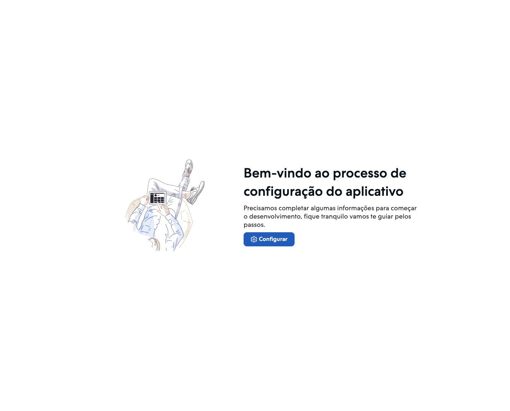
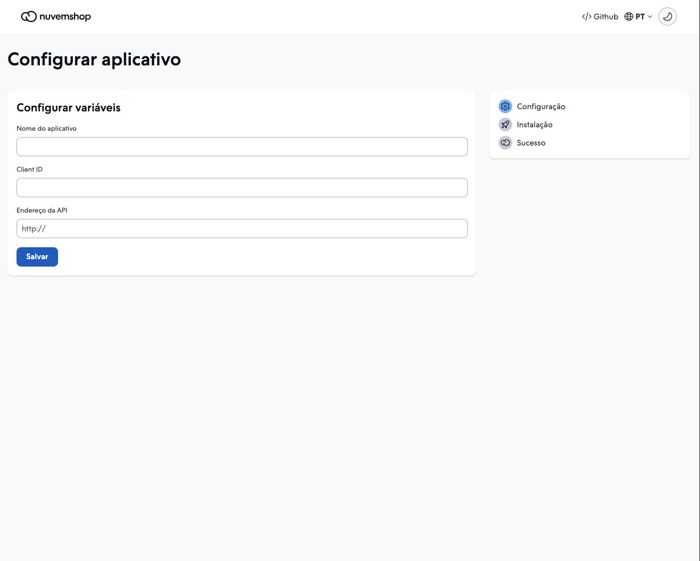
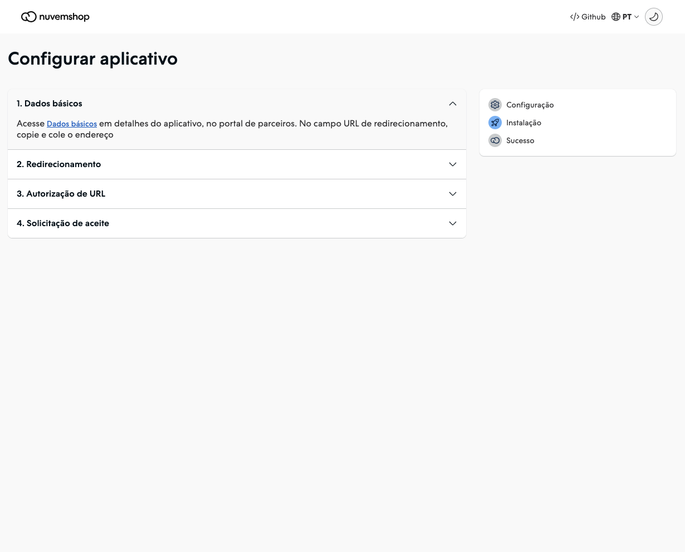
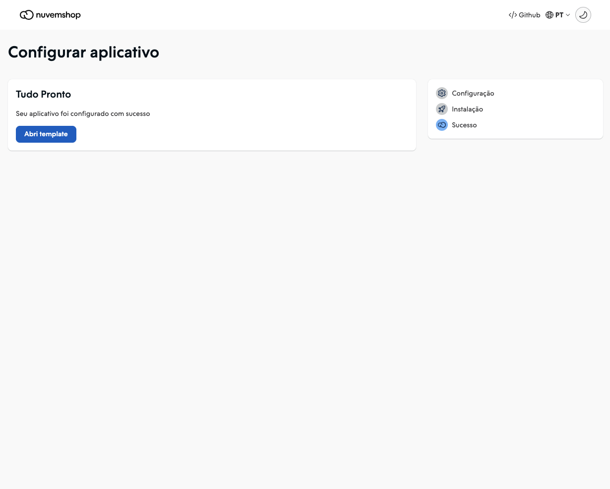
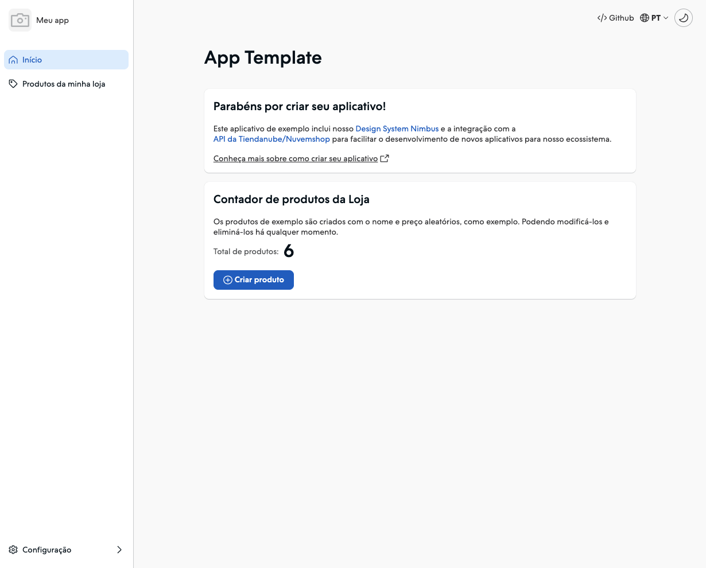

# Nuvemshop react frontend template for External Apps

Welcome to the repository for the interface of Nuvemshop initial app templates using React. This repository serves as a submodule for specific app templates, providing a starting point for development.

## Developer Resources

Here you will find essential resources to kickstart Nuvemshop app development:

- [Introduction to Nuvemshop Apps](https://dev.nuvemshop.com.br/en/docs/getting-started)
- [App Authentication](https://dev.nuvemshop.com.br/en/docs/applications/overview#authenticating-your-application)
- [Nexo](https://dev.nuvemshop.com.br/en/docs/developer-tools/nexo)
- [Nimbus](https://dev.nuvemshop.com.br/en/docs/developer-tools/nimbus)
- [Nuvemshop API Library Documentation](https://dev.nuvemshop.com.br/en/docs/developer-tools/nuvemshop-api/)

## Configuring the project

- When running the frontend application you will find a step-by-step guide for the integration of your application to be carried out successfully.

  

- To proceed we need to configure the environment variables correctly as requested.

  

  You must enter the name of your application, the client ID of your application which can be found in the Partner Portal in the application details section and finally the API address field which is the address where your API is running .

- Now just follow the steps below and your authentication will be successful.

  

- Your application is now successfully integrated and you can now continue developing your app.

  

  

## License

This repository is available as open-source under the terms of the [MIT License](https://opensource.org/license/mit/). Be sure to review and comply with the license guidelines when using this code.
